<p align="center">
  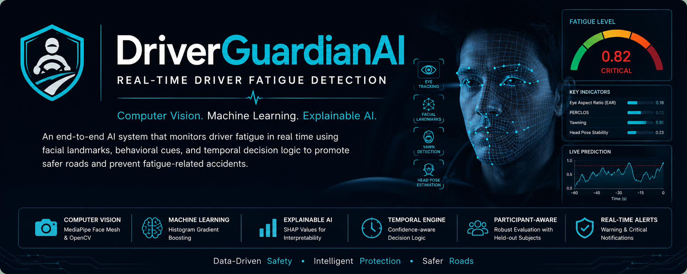
</p>

<h1 align="center">🚗 DriverGuardianAI</h1>

<p align="center">
  <strong>Real-Time Driver Fatigue Detection using Computer Vision, Explainable AI and Temporal Decision Intelligence</strong>
</p>

<p align="center">
  
  
  
  
  
  
  
  
</p>

---

## Overview

DriverGuardianAI is an end-to-end machine-learning and computer-vision system for detecting signs of driver fatigue from a standard webcam.

The project combines:

- MediaPipe facial landmark detection
- Eye Aspect Ratio (EAR)
- Yawn-score estimation
- Head-tilt analysis
- Histogram Gradient Boosting
- Participant-aware evaluation
- Probability calibration
- SHAP explainability
- Temporal decision logic
- Live webcam inference
- Domain-shift analysis

The project was designed not only to achieve strong offline performance, but also to investigate what happens when a model is moved from controlled data into a real-time webcam environment.

> **Important:** DriverGuardianAI is a research and portfolio prototype. It is not intended for safety-critical, medical, automotive, or production deployment.

---

## 🚀 Highlights

- 🚗 Real-time fatigue detection from a standard webcam
- 👁️ Eye Aspect Ratio, yawn and head-pose analysis
- 🧠 Histogram Gradient Boosting classifier
- 👥 Participant-aware train, calibration and test splits
- 📊 SHAP explainability and permutation importance
- 🔬 Feature-ablation and shortcut-learning analysis
- 📉 Offline-to-live domain-shift evaluation
- ⏱️ Warning, critical and recovery temporal states
- ⚙️ Causal rolling-window temporal feature engineering
- 🖥️ Interactive real-time monitoring dashboard
- 📝 Session-level prediction logging
- 🧪 More than twenty controlled engineering experiments

---

## 🎥 Live Demonstration

<p align="center">
  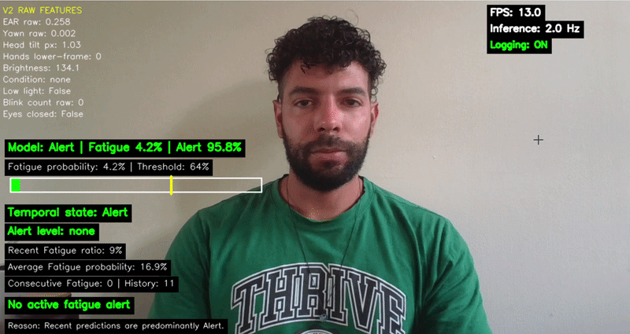
</p>

The demonstration shows:

- live face and feature detection;
- real-time EAR, yawn and head-tilt values;
- fatigue-probability updates;
- temporal monitoring and alert states;
- recovery after fatigue evidence decreases.

---

## 🏗️ System Architecture

<p align="center">
  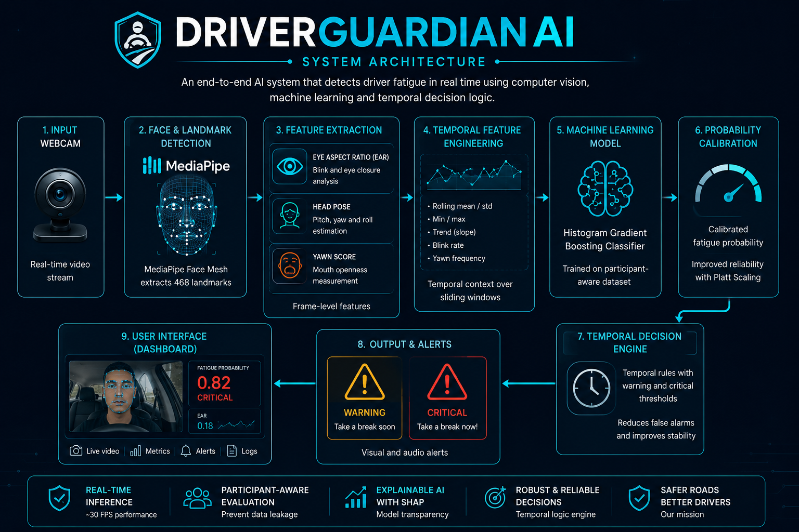
</p>

The real-time pipeline follows this structure:

```text
Webcam
   |
   v
OpenCV + MediaPipe Face Mesh
   |
   v
Behavioural Feature Extraction
   |- Eye Aspect Ratio
   |- Yawn Score
   |- Head Tilt
   |- Lighting / Face Confidence
   |
   v
Histogram Gradient Boosting
   |
   v
Calibrated Fatigue Probability
   |
   v
Temporal Decision Engine
   |- Monitoring
   |- Warning
   |- Critical
   |- Recovery
   |
   v
Dashboard, Alerts and Session Logging
```

More detail is available in [docs/architecture.md](docs/architecture.md).

---

## ⚙️ Machine Learning Pipeline

<p align="center">
  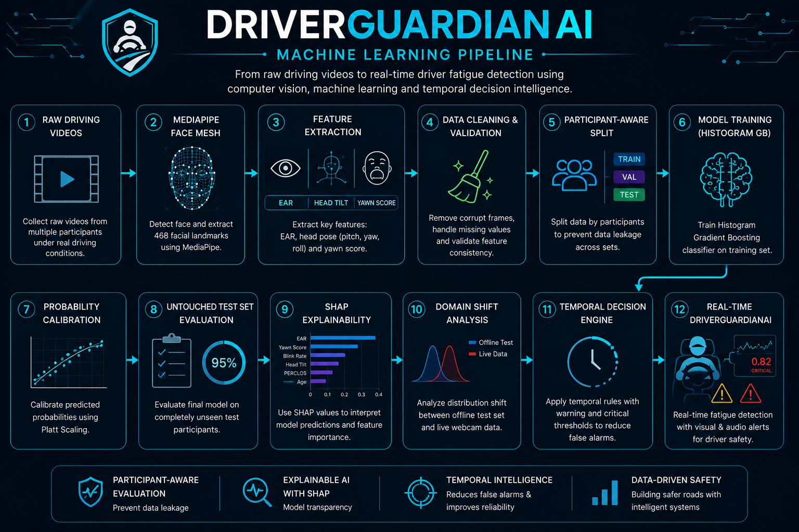
</p>

The complete engineering workflow includes:

1. Raw video and behavioural-data collection
2. MediaPipe landmark extraction
3. Dataset cleaning and validation
4. Participant-aware train, calibration and test splitting
5. Histogram Gradient Boosting training
6. Probability-threshold calibration
7. Untouched participant-held-out evaluation
8. SHAP explainability
9. Domain-shift analysis
10. Temporal-rule evaluation
11. Real-time webcam integration

---

## 🚀 Project Evolution

<p align="center">
  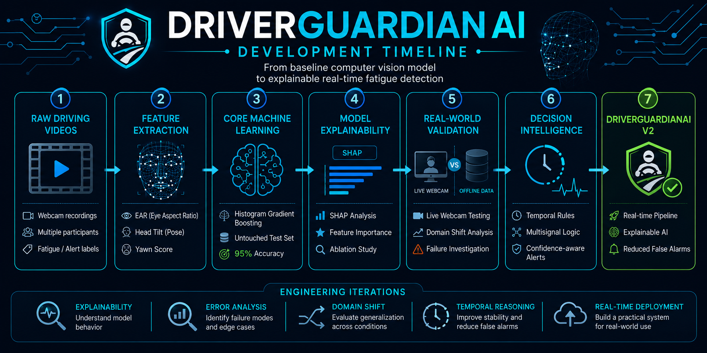
</p>

Rather than stopping after the first working classifier, the project evolved through repeated evaluation and failure analysis.

| Stage | Engineering contribution |
|---|---|
| Dataset | Built and cleaned a participant-labelled fatigue dataset |
| Participant splitting | Prevented participant leakage between train and test sets |
| Classical baselines | Compared Logistic Regression, Random Forest and Histogram Gradient Boosting |
| Calibration | Selected operating thresholds on a separate participant |
| Live validation | Tested the system under real webcam conditions |
| Explainability | Used SHAP to identify dominant and shortcut features |
| Ablation | Removed unreliable features such as `hands_detected` |
| Temporal logic | Compared current, multisignal and confidence-aware rules |
| Temporal features | Added causal rolling statistics and movement features |
| Final prototype | Integrated real-time inference, dashboard and logging |

A longer experiment summary is available in [docs/experiments.md](docs/experiments.md).

---

## 📊 Key Results

### Participant-held-out temporal-feature model

| Metric | Result |
|---|---:|
| Accuracy | **94.7%** |
| Balanced accuracy | **95.1%** |
| Fatigue precision | **98.0%** |
| Fatigue recall / sensitivity | **92.8%** |
| Alert specificity | **97.4%** |
| False-positive rate | **2.6%** |
| ROC-AUC | **96.6%** |
| Average precision | **98.3%** |

<p align="center">
  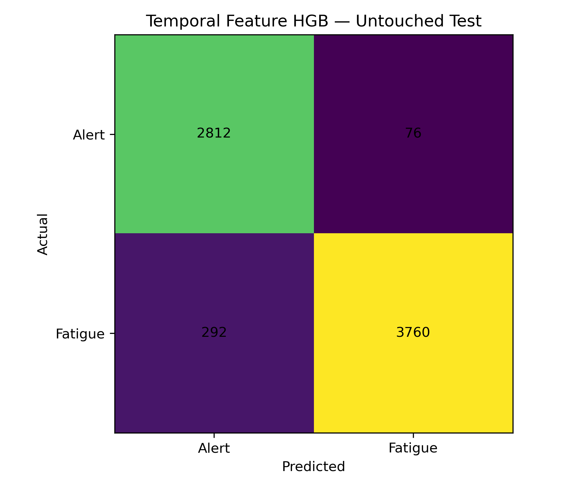
</p>

These results were measured using participant-aware train, calibration and test splits.

---

## 🔬 Feature Ablation

The original full model achieved excellent offline performance but performed poorly during live webcam evaluation.

Ablation analysis showed that `hands_detected` had become a shortcut feature. Removing it reduced offline performance slightly but improved live generalisation.

<p align="center">
  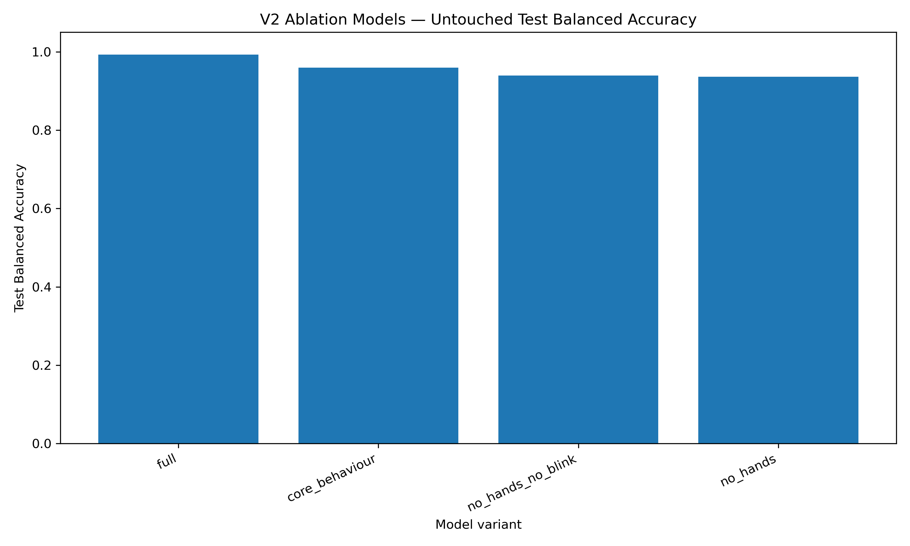
  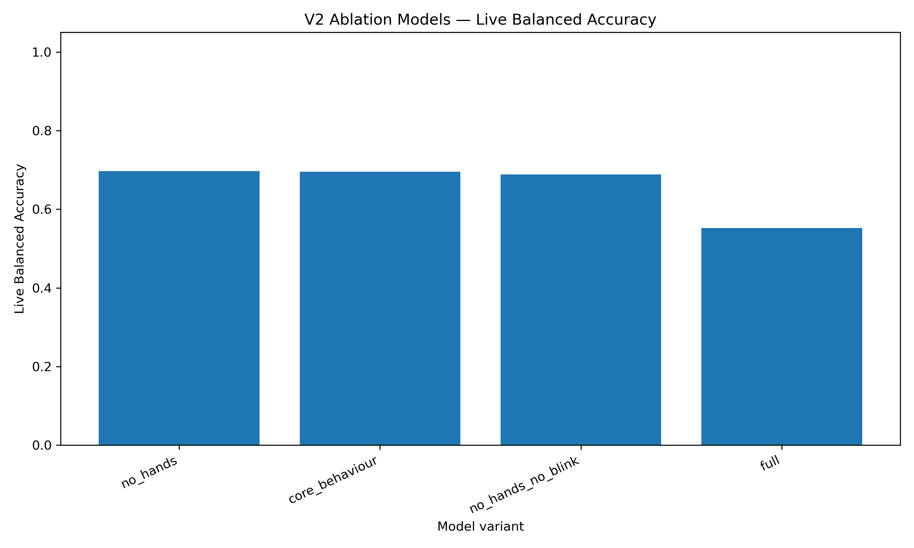
</p>

| Model variant | Test balanced accuracy | Live balanced accuracy |
|---|---:|---:|
| Full feature model | **99.3%** | 55.3% |
| No hands | 93.6% | **69.7%** |
| No hands / no blink | 93.9% | 68.8% |
| Core behaviour | 96.0% | 69.6% |

This experiment demonstrated that the model with the highest offline score was not the most reliable live model.

---

## 🔍 Explainability

SHAP analysis was used to explain live predictions from the core-behaviour model.

<p align="center">
  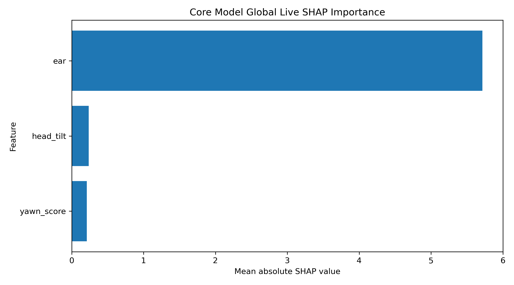
</p>

| Feature | Relative importance |
|---|---:|
| EAR | **92.7%** |
| Head tilt | 3.9% |
| Yawn score | 3.4% |

Among false-Fatigue rows in the Alert session, EAR was the largest SHAP contributor in every analysed case.

This revealed that the simplified model behaved primarily as an EAR detector rather than a robust multi-behaviour fatigue detector.

---

## 📉 Domain Shift

Offline performance did not transfer perfectly to live webcam sessions.

<p align="center">
  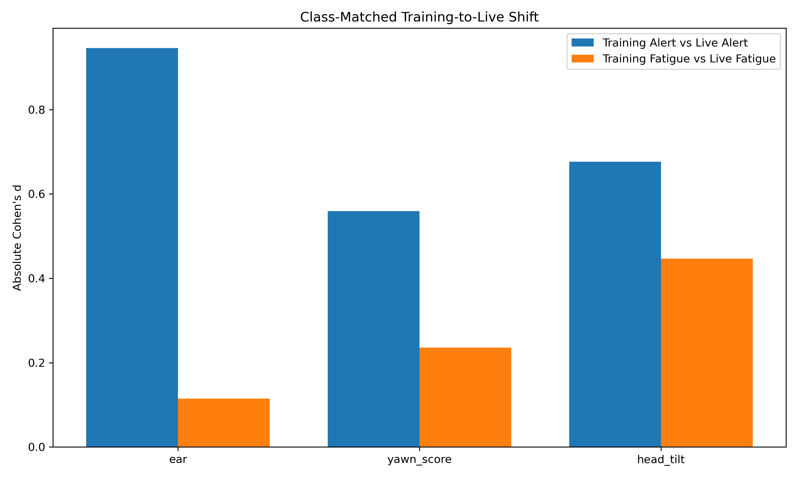
</p>

The analysis identified differences in:

- eye geometry and EAR ranges;
- camera position;
- lighting;
- participant behaviour;
- head movement;
- live feature distributions.

This was one of the most important findings of the project:

> High offline accuracy does not guarantee reliable live behaviour.

---

## ⏱️ Temporal Decision Experiments

Three temporal strategies were evaluated:

1. Current probability-based rule
2. Multisignal rule
3. Confidence-aware rule

<p align="center">
  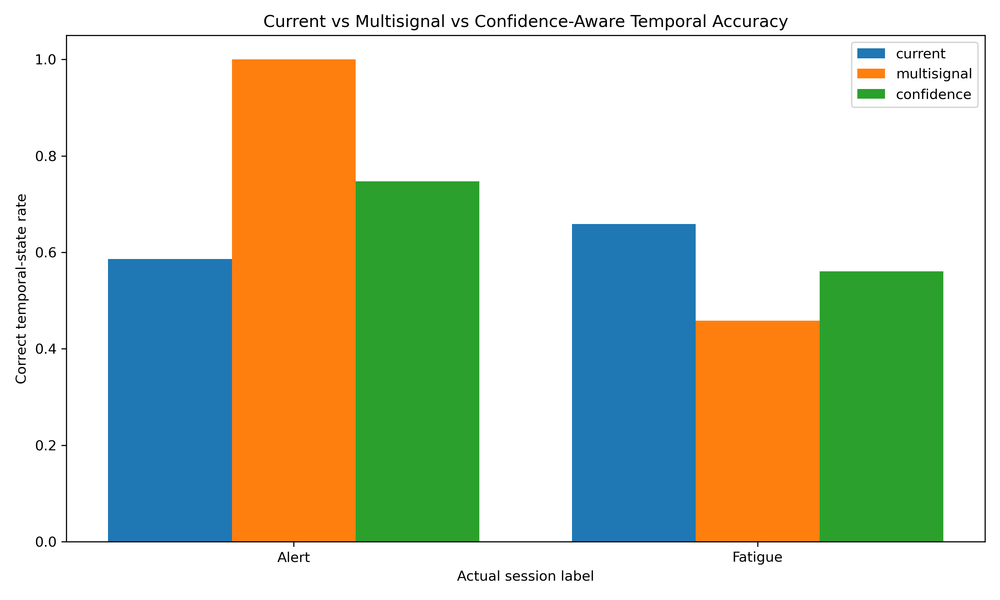
  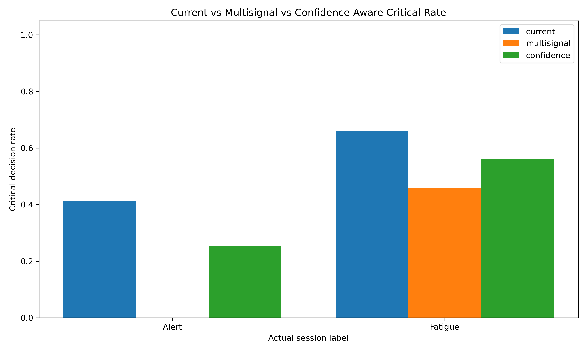
</p>

| Rule | Alert correct-state rate | Fatigue detection rate |
|---|---:|---:|
| Current rule | 58.6% | **65.9%** |
| Multisignal rule | **100.0%** | 45.9% |
| Confidence-aware rule | 74.7% | 56.1% |

The multisignal rule eliminated critical false alarms in one Alert session, but reduced Fatigue sensitivity. The confidence-aware rule produced a middle-ground trade-off.

---

## 🧠 Temporal Feature Engineering

The temporal-feature experiment added 80+ causal engineered inputs, including:

- EAR rolling mean, standard deviation, minimum and maximum;
- EAR velocity and acceleration;
- low-EAR ratios;
- yawn rolling activity;
- head-tilt movement and variability;
- causal windows of 5, 12 and 30 observations.

<p align="center">
  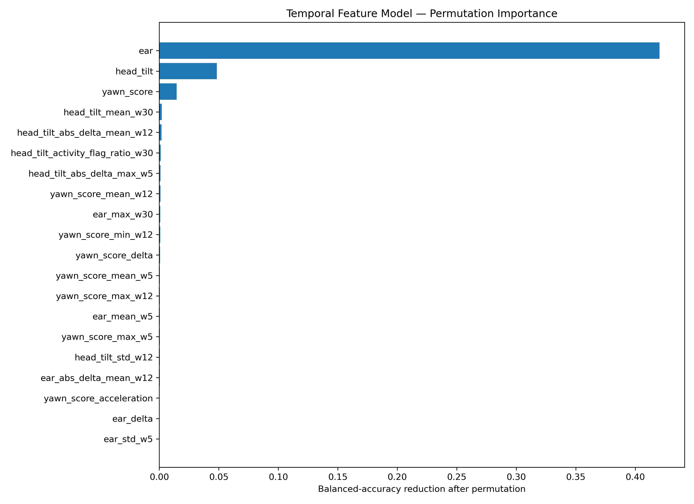
</p>

The model preserved strong participant-held-out performance, but raw EAR still dominated permutation importance.

---

## 💡 Technical Challenges and Solutions

| Challenge | Engineering response |
|---|---|
| Participant leakage | Introduced participant-aware train, calibration and test splits |
| Class imbalance | Used class weighting and balanced evaluation metrics |
| Poor live specificity | Performed live-session evaluation and feature ablation |
| Shortcut learning | Used SHAP and counterfactual feature-reliance analysis |
| Overreliance on EAR | Tested multisignal rules and temporal feature engineering |
| False alerts | Added warning, critical, cooldown and recovery states |
| Offline-to-live mismatch | Performed feature-distribution and domain-shift analysis |
| Unclear probability thresholds | Used separate calibration data for threshold selection |
| Limited interpretability | Added SHAP, permutation importance and diagnostic reports |

---

## 💡 Engineering Lessons

- Participant-aware evaluation is essential when multiple samples come from the same person.
- Random row-level splits can produce misleadingly optimistic results.
- The best offline model is not always the best live model.
- Explainability can reveal shortcut learning that accuracy metrics cannot.
- Domain shift should be measured, not assumed away.
- Probability calibration and temporal rules introduce operating trade-offs.
- Negative experimental results are useful when they identify the real bottleneck.
- More complex models are not automatically better when data diversity is limited.
- Real-time validation is a separate engineering problem from offline model training.

---

## 📂 Repository Structure

```text
DriverGuardianAI/
├── assets/
│   ├── banner/
│   ├── charts/
│   ├── demo/
│   ├── diagrams/
│   ├── screenshots/
│   └── timeline/
├── config/
├── diagnostics/
├── docs/
├── examples/
├── src/
│   ├── legacy/
│   └── v2/
├── tests/
├── realtime_driver_guardian_core_v2.py
├── requirements.txt
├── LICENSE
└── README.md
```

---

## 🧩 Main V2 Scripts

| Script | Purpose |
|---|---|
| `build_raw_dataset.py` | Combines raw participant-session files |
| `clean_dataset.py` | Cleans invalid rows and normalises labels |
| `create_participant_splits.py` | Creates leakage-free participant splits |
| `build_feature_contract_v2.py` | Defines expected live-feature ranges |
| `vision_agent_v2.py` | Extracts raw live behavioural features |
| `train_hgb_v2.py` | Trains the calibrated HGB baseline |
| `train_ablation_models_v2.py` | Compares shortcut-feature ablations |
| `compare_core_feature_distributions_v2.py` | Measures training-to-live shift |
| `diagnose_feature_dependence_v2.py` | Runs counterfactual feature tests |
| `diagnose_all_feature_reliance_v2.py` | Measures reliance on every feature |
| `explain_core_live_predictions_v2.py` | Produces SHAP live explanations |
| `evaluate_multisignal_temporal_rules_v2.py` | Evaluates multisignal logic |
| `evaluate_confidence_temporal_rules_v2.py` | Evaluates confidence-aware rules |
| `train_temporal_features_v2.py` | Trains with causal rolling features |

---

## 🛠️ Technology Stack

| Technology | Purpose |
|---|---|
| Python | Main implementation |
| OpenCV | Webcam capture and frame processing |
| MediaPipe | Facial landmark extraction |
| scikit-learn | Histogram Gradient Boosting and preprocessing |
| SHAP | Model explainability |
| Pandas | Dataset preparation and experiment reports |
| NumPy | Numerical feature processing |
| Matplotlib | Evaluation and diagnostic visualisation |
| Joblib | Model serialisation |
| PyTorch | Earlier neural-network experiments |
| YAML | Runtime configuration |

---

## 🚀 Installation

### 1. Clone the repository

```bash
git clone https://github.com/YOUR_USERNAME/DriverGuardianAI.git
cd DriverGuardianAI
```

### 2. Create a virtual environment

#### Windows PowerShell

```powershell
python -m venv .venv
.venv\Scripts\Activate.ps1
```

#### macOS or Linux

```bash
python3 -m venv .venv
source .venv/bin/activate
```

### 3. Install dependencies

```bash
python -m pip install --upgrade pip
pip install -r requirements.txt
```

---

## ▶️ Running the Real-Time Application

```bash
python realtime_driver_guardian_core_v2.py
```

The application expects a locally trained model at:

```text
models/v2/ablation/driver_guardian_core_behaviour.joblib
```

| Key | Action |
|---|---|
| `Q` or `Esc` | Quit |
| `R` | Reset temporal memory |
| `I` | Print model information |
| `0` | Condition: none |
| `1` | Condition: glasses |
| `2` | Condition: hat |
| `3` | Condition: dark |
| `L` | Toggle session logging |

---

## 🧪 Training

The original participant dataset is intentionally not included in the public repository.

Place split files under:

```text
data/splits/v2/
├── train.csv
├── calibration.csv
└── test.csv
```

Train the calibrated HGB baseline:

```bash
python src/v2/train_hgb_v2.py
```

Train the temporal-feature model:

```bash
python src/v2/train_temporal_features_v2.py
```

Run feature-ablation experiments:

```bash
python src/v2/train_ablation_models_v2.py
```

---

## 🔒 Data Privacy

The public repository intentionally excludes:

- participant videos;
- personal webcam recordings;
- raw participant datasets;
- processed participant datasets;
- full live-session logs;
- trained model artifacts;
- generated experiment outputs.

This protects participant privacy and keeps the repository focused on reproducible source code and curated evidence.

---

## ⚠️ Limitations

- Only eight unique participants
- Controlled collection conditions
- Limited demographic diversity
- Limited camera and lighting diversity
- Simulated rather than natural fatigue
- Strong reliance on eye geometry
- Development live sessions reused for some tuning experiments
- No automotive, medical, safety or regulatory validation

See [docs/limitations.md](docs/limitations.md) for more detail.

---

## 🛣️ Future Work

- Collect a larger and more diverse dataset
- Add multi-day recordings for each participant
- Add infrared and low-light support
- Improve blink-duration and PERCLOS extraction
- Add camera and face-geometry normalisation
- Evaluate sequence models on larger datasets
- Run independent live validation sessions
- Package the project for edge deployment
- Add automated tests and continuous integration
- Add a model card and data card
- Improve real-time UI accessibility

---

## 📚 Documentation

- [System architecture](docs/architecture.md)
- [Experiment history](docs/experiments.md)
- [Limitations and future work](docs/limitations.md)
- [Example-data guidance](examples/README.md)

---

## 📌 Project Status

```text
Research prototype
Portfolio-ready
Not safety-certified
Not production-ready
```

The strongest contribution of DriverGuardianAI is not a claim of perfect fatigue detection. It is the complete applied-ML workflow used to identify, explain and document the gap between strong offline evaluation and real-world live behaviour.

---

## 📄 License

This project is available under the terms described in [LICENSE](LICENSE).

---

## 👤 Author

**Vinicius**

Machine Learning · Computer Vision · Applied AI

Update these links before publishing:

```text
LinkedIn: https://www.linkedin.com/in/vini-do-amaral-35149841/
GitHub: https://github.com/Viniamaral1
```

---

## 🙏 Acknowledgements

DriverGuardianAI uses open-source tools from the Python, OpenCV, MediaPipe, scikit-learn and SHAP ecosystems.
